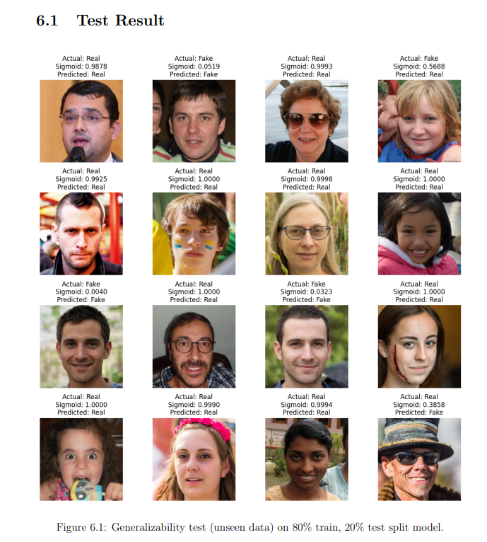
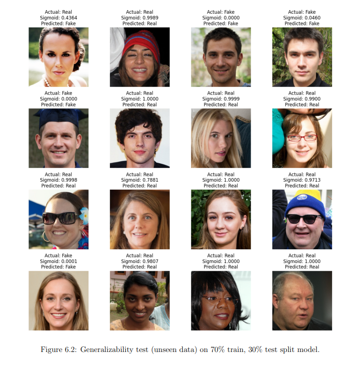

# Deepfake Detection: An AI-Based Solution

## Problem Statement

Deepfake technology has advanced rapidly, especially with the development of sophisticated generative neural networks such as GANs (Generative Adversarial Networks). These advances present significant challenges across various domains, making the detection of manipulated media more crucial than ever. Below are the core issues that motivated this project:

1. **Increased Ease of Creating Deepfakes**  
   With the rise of advanced generative models, particularly GANs, the creation of highly realistic fake videos has become significantly easier. This makes it challenging to ensure authenticity in digital content, posing risks in video editing and manipulation.

2. **Privacy Breaches and Serious Risks**  
   The seamless integration of superimposed human faces onto original video subjects, enabled by deepfake technology, has led to severe breaches of privacy and identity. This technology often contributes to the spread of misinformation and identity theft. The convincing nature of deepfakes creates serious political, social, financial, and legal risks, highlighting the urgent need for effective detection mechanisms.

3. **Inadequacy of Current Detection Methods and Need for Robust Generalization**  
   Current deepfake detection techniques, which primarily rely on binary classifiers, show high accuracy within specific training datasets but struggle to generalize effectively to new, unseen deepfake methods. This exposes a significant vulnerability in existing approaches, underscoring the need for more robust and adaptable detection systems capable of performing well across diverse datasets.

## Project Objectives

This project aims to develop an AI-based deepfake detection system for identifying face-forged “deepfake” images. Additionally, we aim to conduct a comprehensive comparative analysis of different deepfake detection methods to identify the most effective approach for generalizing across various unseen datasets.

### Objectives Summary:
- Build a deepfake detection system to identify manipulated facial images.
- Evaluate the performance of different detection approaches on diverse datasets.
- Improve model generalization to detect deepfakes created by novel methods.

### Example Results
Below are some test results generated by the deepfake detection model:

